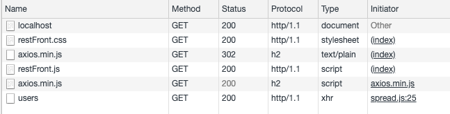
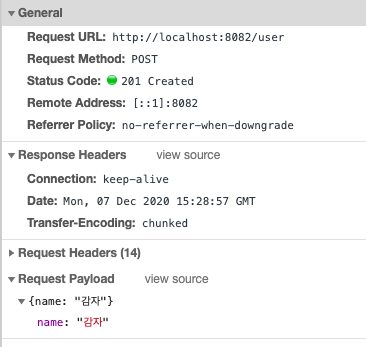

# 4장 http 모듈로 서버 만들기 🚀

### 4.1 요청과 응답 이해하기

서버는 클라이언트가 있기에 동작한다. 클라이언트로부터 요청(request)을 받으면, 읽고 처리한 뒤 응답(response)을 보낸다.

요청이 왔을 때 어떤 작업을 수행할 지 이벤트 리스너를 미리 등록해야 한다.


> **NOTE: localhost와 포트란?**
>
> localhost는 현재 컴퓨터의 내부 주소를 가리킨다. IP로는 127.0.0.1.
>
> 포트는 서버 내에서 프로세스를 구분하는 번호다. 
>
> 유명한 포트 번호 : 21(FTP), 80(HTTP), 443(HTTPS), 3306(MYSQL)
>
> 리눅스와 맥에서는 1024번 이하의 포트에 연결할 때 관리자 권한이 필요하므로 명령어 앞에 sudo를 붙여야 한다.


#### 기본 사용 방법 

```javascript
const http = require('http');

// 방법 1 (listen 메서드에 콜백 함수)
http.createServer((req, res) => { // param: 요청에 대한 콜백 함수
	res.writeHead(200, { 'Content-Type': 'text/html; charset=uft-8' });
  // writeHead: 응답에 대한 정보(헤더)를 기록하는 메서드
  
	res.write('<h1>Hello Node!</h1>');
  // write: 클라이언트로 보낼 데이터(body)를 기록하는 메서드
  
	res.end('<p>Hello Server!</p>')
  // end: 응답을 종료하는 메서드
})
	.listen(8080, () => {
  // listen: 클라이언트에 공개한 포트 번호 및 연결 완료 후 실행될 콜백 함수
		console.log('8080번 포트에서 서버 대기 중입니다!');
	})

// 방법 2 (listening 이벤트 리스너)
const server = http.createServer((req, res) => {
	res.writeHead(200, { 'Content-Type': 'text/html; charset=uft-8' });
	res.write('<h1>Hello Node!</h1>');
	res.end('<p>Hello Server!</p>')
})
server.listen(8080);
server.on('listening', () => {
	console.log('8080번 포트에서 서버 대기 중입니다!');
})
server.on('error', (err) => {
	console.error(err);
})

```


#### HTML 파일을 fs 모듈로 읽어오기

```javascript
const http = require('http');
const fs = require('fs').promises;

http.createServer(async (req, res) => {
	try {
		const data = await fs.readFile('./server2.html');
    // fs로 HTML 파일을 읽고, 버퍼를 클라이언트에 보낸다.
		res.writeHead(200, { 'Content-Type': 'text/html; charset=uft-8' });
		res.end(data);
	} catch (err) {
		console.log(err);
		res.writeHead(500, { 'Content-Type': 'plain; charset=uft-8' });
		res.end(err.message);
	} 
})
.listen(8081, () => {
	console.log('8081번 포트에서 서버 대기 중입니다!');
})

```


> **NOTE: HTTP 상태 코드**
>
> 브라우저는 서버에서 보내주는 상태 코드를 보고 요청이 성공했는지 실패했는지 판단한다.
>
> - 2XX : 성공을 알리는 상태 코드. 200(성공), 201(작성됨)
> - 3XX : 리다이렉션(다른 페이지로 이동)을 알리는 상태 코드. 301(영구 이동), 302(임시 이동), 304(수정되지 않음)
> - 4XX : 요청 오류. 400(잘못된 요청), 401(권한 없음), 403(금지됨), 404(찾을 수 없음)
> - 5XX : 서버 오류. writeHead로 직접 보내는 경우는 거의 없고, 예기치 못한 에러 발생 시 서버가 알아서 보낸다. 500(내부 서버 오류), 502(불량 게이트웨이), 503(서비스를 사용할 수 없음)


### 4.2 REST와 라우팅 사용하기

서버에 요청을 보낼 때 주소를 통해 요청의 내용을 표현한다. 그러므로 서버가 이해하기 쉬운 주소를 사용하는 것이 좋다 = REST

#### REST란

REpresentational State Transfer의 줄임말.

서버의 자원을 정의하고 자원에 대한 주소를 지정하는 방법 또는 약속.

주소의 의미를 명확히 전달하기 위해 명사로 구성된다. (`/user`, `/post`)


#### HTTP 요청 메서드

주소 외에 HTTP 요청 메서드를 사용.

| HTTP 요청 메서드 종류 | 설명                                                         |
| --------------------- | ------------------------------------------------------------ |
| `GET`                 | 서버 자원을 가져오고자 할 때 사용.<br />요청의 본문에 데이터를 넣지 않는다.<br />데이터를 서버로 보내야 한다면 쿼리스트링을 사용. |
| `POST`                | 서버에 자원을 새로 등록하고자 할 때 사용<br />요청의 본문에 새로 등록한 데이터를 넣어 보냄. |
| `PUT`                 | 서버의 자원을 요청에 들어 있는 자원으로 치환할 때 사용.<br />요청의 본문에 치환할 데이터를 넣어 보냄. |
| `PATCH`               | 서버 자원의 일부만 수정하고자 할 때 사용<br />요청의 본문에 일부 수정할 데이터를 넣어 보냄. |
| `DELETE`              | 서버의 자원을 삭제하고자 할 때 사용.<br />요청의 본문에 데이터를 넣지 않는다. |
| `OPTIONS`             | 요청을 하기 전에 통신 옵션을 설명하기 위해 사용.             |


#### REST의 장점

- 주소와 메서드만 보고 요청의 내용을 알아볼 수 있다.
- GET의 경우 브라우저에서 캐싱이 가능하여 성능 향상도 기대.
- 클라이언트가 누구든 상관 없이 같은 방식으로 서버와 소통할 수 있다. 
- 서버와 클라이언트가 분리되어 있으므로 추후 서버를 확장할 때 클라이언트에 구애받지 않는다.


#### RESTful한 웹 서버 만들기

> RESTful : REST를 따르는 서버를 일컫는 말


```javascript
const http = require('http');
const fs = require('fs').promises;

const users = {}; // 데이터 저장용

http.createServer(async (req, res) => {
	try {
		console.log(req.method, req.url);
		if (req.method === 'GET') {
			if (req.url === '/') {
				const data = await fs.readFile('./restFront.html');
				res.writeHead(200, { 'Content-Type': 'text/html; charset=utf-8' });
				return res.end(data);
			} else if (req.url === '/about') {
				const data = await fs.readFile('./about.html');
				res.writeHead(200, { 'Content-Type': 'text/html; charset=utf-8' });
				return res.end(data);
			} else if (req.url === '/users') {
				res.writeHead(200, { 'Content-Type': 'text/plain; charset=utf-8' });
				return res.end(JSON.stringify(users));
			}
			// 주소가 /도 /about도 /users도 아니면
			try {
				const data = await fs.readFile(`.${req.url}`);
        return res.end(data);
			} catch (err) {
				// 주소에 해당하는 라우트를 못 찾았다는 404 Not Found error 발생
			}
		} else if (req.method === 'POST') {
			if (req.url === '/user') {
				let body = '';
				// 요청의 body를 stream형식으로 받음
				req.on('data', (data) => {
					body += data;
				});
				// 요청의 body를 받은 후 실행됨.
				return req.on('end', () => {
					console.log('POST 본문(Body):', body);
					const { name } = JSON.parse(body);
					const id = Date.now();
					users[id] = name;
					res.writeHead(201);
					res.end('등록 성공');
				})
			}
		} else if (req.method === 'PUT') {
			if (req.url.startsWith('/user/')) {
				const key = req.url.split('/')[2];
				let body = '';
				req.on('data', (data) => {
					body += data;
				});
				return req.on('end', () => {
					console.log('PUT 본문(Body):', body);
					users[key] = JSON.parse(body).name;
					return res.end(JSON.stringify(users));
				})
			}
		} else if (req.method === 'DELETE') {
			if (req.url.startsWith('/user/')) {
				const key = req.url.split('/')[2];
				delete users[key];
				return res.end(JSON.stringify(users));
			}
		}
		res.writeHead(404);
		return res.end('NOT FOUND');
	} catch (err) {
		console.error(err);
    res.writeHead(500, { 'Content-Type': 'text/plain; charset=utf-8' });
    res.end(err.message);
	}
})
	.listen(8082, () => {
		console.log('8082번 포트에서 서버 대기 중입니다');
	});


```


> **NOTE: res.end 앞에 return을 붙이는 이유**
>
> 노드도 일반적으로 자바스크립트 문법을 따르므로 return을 붙이지 않는 한 함수가 종료되지 않는다.
>
> return을 붙이지 않아서 res.end 같은 메서드가 여러 번 실행된다면 에러 발생.


#### Network 탭으로 확인하기

- Name: 요청 주소
- Method: 요청 메서드
- Status: HTTP 응답 코드
- Protocol: 통신 프로토콜
- Type: 요청의 종류. `xhr` 는 AJAX 요청




> **NOTE: 헤더와 본문**
>
> - General: 공통된 헤더
> - Response Headers: 응답의 헤더
> - Request Headers: 요청의 헤더
> - Request Payload: 응답의 본문




### 4.3 쿠키와 세션 이해하기

로그인을 구현하려면 쿠키와 세션을 이해해야 한다.

서버로부터 쿠키가 오면 웹 브라우저는 쿠키를 저장해두었다가 다음에 요청할 때마다 쿠키를 동봉해서 보낸다. 서버는 요청에 들어 있는 쿠키를 읽어서 사용자가 누구인지 파악한다.

쿠키 : 이용자 정보를 담고 있는 키-값의 쌍. 유효기간이 있다. 요청의 헤더(Cookie)에 담겨 전송되고, 브라우저는 응답의 헤더(Set-Cookie)에 따라 쿠키를 전송한다.


#### 쿠키 브라우저에 전송하기

```javascript
const http = require('http');

http.createServer((req, res) => {
	console.log(req.url, req.headers.cookie);
	res.writeHead(200, { 'Set-Cookie' : 'mycookie=test' });
	res.end('Hello Cookie');
})
	.listen(8083, () => {
		console.log('8083번 포트에서 서버 대기 중입니다!');
	})

```


#### 쿠키로 유저 식별하기

```javascript
const http = require('http');
const fs = require('fs').promises;
const url = require('url');
const qs = require('querystring');

// 쿠키를 쉽게 사용하기 위해 객체 형식으로 변환
const parseCookies = (cookie = '') =>
  cookie
    .split(';')
    .map(v => v.split('='))
    .reduce((acc, [k, v]) => {
      acc[k.trim()] = decodeURIComponent(v);
      return acc;
    }, {});

http.createServer(async (req, res) => {
  const cookies = parseCookies(req.headers.cookie);
  // 주소가 /login으로 시작하는 경우
  if (req.url.startsWith('/login')) {
    const { query } = url.parse(req.url);
    const { name } = qs.parse(query);
    const expires = new Date();
    // 쿠키 유효 시간을 현재시간 + 5분으로 설정
    expires.setMinutes(expires.getMinutes() + 5);
    res.writeHead(302, {
      Location: '/',
      'Set-Cookie': `name=${encodeURIComponent(name)}; Expires=${expires.toGMTString()}; HttpOnly; Path=/`,
    });
    res.end();
  // name이라는 쿠키가 있는 경우
  } else if (cookies.name) {
    res.writeHead(200, { 'Content-Type': 'text/plain; charset=utf-8' });
    res.end(`${cookies.name}님 안녕하세요`);
  } else {
    try {
      const data = await fs.readFile('./cookie2.html');
      res.writeHead(200, { 'Content-Type': 'text/html; charset=utf-8' });
      res.end(data);
    } catch (err) {
      res.writeHead(500, { 'Content-Type': 'text/plain; charset=utf-8' });
      res.end(err.message);
    }
  }
})
  .listen(8084, () => {
    console.log('8084번 포트에서 서버 대기 중입니다!');
  });

```


#### Set-Cookie 옵션

| 옵션명          | 설명                                                         |
| --------------- | ------------------------------------------------------------ |
| 쿠키명=쿠키값   | 기본적인 쿠키의 값. `mycookie=test`                          |
| Expires=날짜    | 만료 기한. 기본값은 클라이언트가 종료될 때까지               |
| Max-age=초      | `Expires` 와 달리 초를 입력할 수 있다. `Expires` 보다 우선.  |
| Domain=도메인명 | 쿠키가 전송될 도메인을 특정할 수 있다. 기본값은 현재 도메인. |
| Path=URL        | 쿠키가 전송될 URL을 특정할 수 있다. 기본값은 '/'이며 이 경우 모든 URL에서 쿠키를 전송할 수 있다. |
| Secure          | HTTPS일 때만 쿠키 전송                                       |
| HttpOnly        | 설정 시 자바스크립트에서 쿠키에 접근할 수 없음. 쿠키 조작 방지용. |


#### 세션

서버에 사용자 정보를 저장하고 클라이언트와는 세션 아이디로만 소통하는 방식.

세션 아이디는 꼭 쿠키를 사용하지 않아도 되지만 제일 간단하여 많이 사용됨.

세션쿠키 : 세션을 위해 사용하는 쿠키

세션을 저장하기 위해 레디스(Redis)나 맴캐시드(Memcached)같은 데이터베이스에 넣어둔다.


#### 세션 쿠키와 일반 쿠키 비교

```javascript
// Cookie
res.writeHead(302, {
      Location: '/',
      'Set-Cookie': `name=${encodeURIComponent(name)}; Expires=${expires.toGMTString()}; HttpOnly; Path=/`,
    });

// Session Cookie
const session = {};
...
const uniqueInt = Date.now();
    session[uniqueInt] = {
      name,
      expires,
    };
...
res.writeHead(302, {
      Location: '/',
      'Set-Cookie': `session=${uniqueInt}; Expires=${expires.toGMTString()}; HttpOnly; Path=/`,
    });
```


### 4.4 https와 http2

#### https 모듈

웹 서버에 SSL 암호화를 추가하는 모듈. 주로 로그인이나 결제가 필요한 창에서 적용한다.

인증 기관에서 인증서를 구입해야 하며, Let's Encrypt같은 기관에서 무료로 발급해주기도 한다.

##### https 모듈 코드

```javascript
const https = require('https');
const fs = require('fs');

// createServer가 인증서 옵션 객체를 추가 인수로 받는다.
https.createServer({
  cert: fs.readFileSync('도메인 인증서 경로'),
  key: fs.readFileSync('도메인 비밀키 경로'),
  ca: [
    fs.readFileSync('상위 인증서 경로'),
    fs.readFileSync('상위 인증서 경로'),
  ],
}, (req, res) => {
  res.writeHead(200, { 'Content-Type': 'text/html; charset=utf-8' });
  res.write('<h1>Hello Node!</h1>');
  res.end('<p>Hello Server!</p>');
})

// https이므로 443포트를 사용
  .listen(443, () => {
    console.log('443번 포트에서 서버 대기 중입니다!');
  });

```


#### http2 모듈

SSL 암호화와 더불어 최신 HTTP 프로토콜인 http/2를 사용할 수 있다.

http/2를 사용하면 http/1.1보다 효율적으로 요청을 보내므로 웹의 속도를 개선할 수 있다.

##### http2 모듈 코드

```javascript
const http2 = require('http2');
const fs = require('fs');

http2.createSecureServer({
  cert: fs.readFileSync('도메인 인증서 경로'),
  key: fs.readFileSync('도메인 비밀키 경로'),
  ca: [
    fs.readFileSync('상위 인증서 경로'),
    fs.readFileSync('상위 인증서 경로'),
  ],
}, (req, res) => {
  res.writeHead(200, { 'Content-Type': 'text/html; charset=utf-8' });
  res.write('<h1>Hello Node!</h1>');
  res.end('<p>Hello Server!</p>');
})
  .listen(443, () => {
    console.log('443번 포트에서 서버 대기 중입니다!');
  });
```


### 4.5 cluster

#### cluster 모듈

싱글 프로세스로 동작하는 노드가 CPU 코어를 모두 사용할 수 있게 하는 모듈.

요청이 많이 들어왔을 때 병렬로 실행된 서버의 개수만큼 요청이 분산되게 할 수 있으므로 서버의 부담을 줄일 수 있다.


##### cluster 모듈 코드

```javascript
const cluster = require('cluster');
const http = require('http');
const numCPUs = require('os').cpus().length;

if (cluster.isMaster) {
	console.log(`마스터 프로세스 아이디: ${process.pid}`);
	// CPU 개수만큼 워커를 생산
	for (let i = 0; i < numCPUs; i++) {
		cluster.fork();
	}
	// 워커가 종료됐을 때
	cluster.on('exit', (worker, code, signal) => {
		console.log(`${worker.process.pid}번 워커가 종료되었습니다.`);
		console.log('code', code, 'signal', signal);
	})
} else {
	// 워커들이 포트에서 대기
  http.createServer((req, res) => {
    res.writeHead(200, { 'Content-Type': 'text/html; charset=utf-8' });
    res.write('<h1>Hello Node!</h1>');
    res.end('<p>Hello Cluster!</p>');
    setTimeout(() => { // 워커 존재를 확인하기 위해 1초마다 강제 종료
      process.exit(1);
    }, 1000);
  }).listen(8086);

  console.log(`${process.pid}번 워커 실행`);
}

```


#### 클러스터링

클러스터링을 적용하면 예기치 못한 에러로 서버가 종료되는 현상을 방지할 수 있다.

직접 cluster 모듈로 클러스터링을 구현할 수 있지만 실무에서는 pm2등의 모듈을 사용한다.